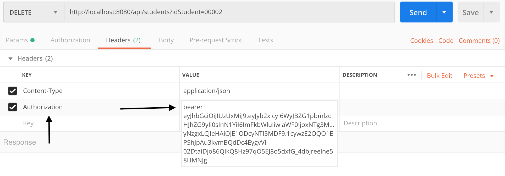
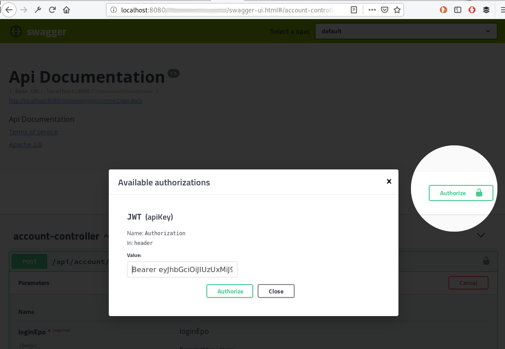

# Spring webFlux

Application to manage endpoints with scope functional and annotations to get responses to some reactive operations. 

Technologies used:
  - Spring boot 2
  - Spring reactive
  - MongoDB 4.x
  - Java 11
  - Docker (to deploy the MongoDB database)

# EndPoints
| Login Controller | Path |
| ------ | ------ |
| Login ```POST``` | ```/login``` |
| Login V2 ```POST```| ```/v2/login``` |

> The followings endPoints required a JWT token to be consumed

| Students Controller | Path |
| ------ | ------ |
| List ```GET``` | ```/api/students``` |
| List by ID ```GET```| ```/api/students/listById?idStudent=XXXX``` |
| Register ```POST``` | ```/api/students``` |
| Modify ```PUT``` | ```/api/students``` |
| Delete ```DELETE``` | ```api/students?idStudent=XXXX``` |
| List Parallel ```GET``` | ```api/students/sortedByAgeParallel``` |

| Course Controller | Path |
| ------ | ------ |
| List ```GET``` | ```/api/courses``` |
| List by ID ```GET```| ```/api/courses/listById?idCourse=XXXX``` |
| Register ```POST``` | ```/api/courses``` |
| Modify ```PUT``` | ```/api/courses``` |
| Delete ```DELETE``` | ```api/courses?idCourse=XXXX``` |

| Enrollment Controller | Path |
| ------ | ------ |
| List ```GET``` | ```/api/enrollments``` |
| Register ```POST``` | ```/api/enrollments``` |

### Star MongoDB with Docker

Drive into the project folder in a CMD console to find the file **docker-compose.yml** now ejecute the command 
```
docker-compose start -d
```
This command is goin to start the **MongoDB database** and also start the app **Mongo Express** to explore and manage the database.

### Run the APP

This application is going to start in the port 8080 so you can access to swagger with the following URL 
http://localhost:8080/swagger-ui.html

> The endpoints required a JWT token to can execute it so an important thing is set it to the request at the following mode:

##### POSTMAN

##### SWAGGER


##### Configuration
By Default the app config the JWT token duration with 120seg
```yaml
jjwt:
  secret: 4u7x!A%D*G-KaNdRgUkXp2s5v8y/B?E(H+MbQeShVmYq3t6w9z$C&F)J@NcRfUjW
  expiration: 120
```
The user and pass to consume the endPoint can be config here.
```yaml
springreactive:
  username: admin
  pass: root
```